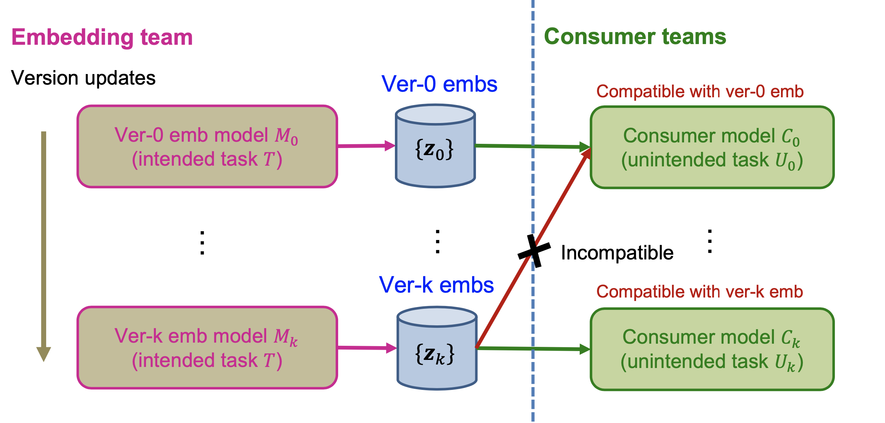
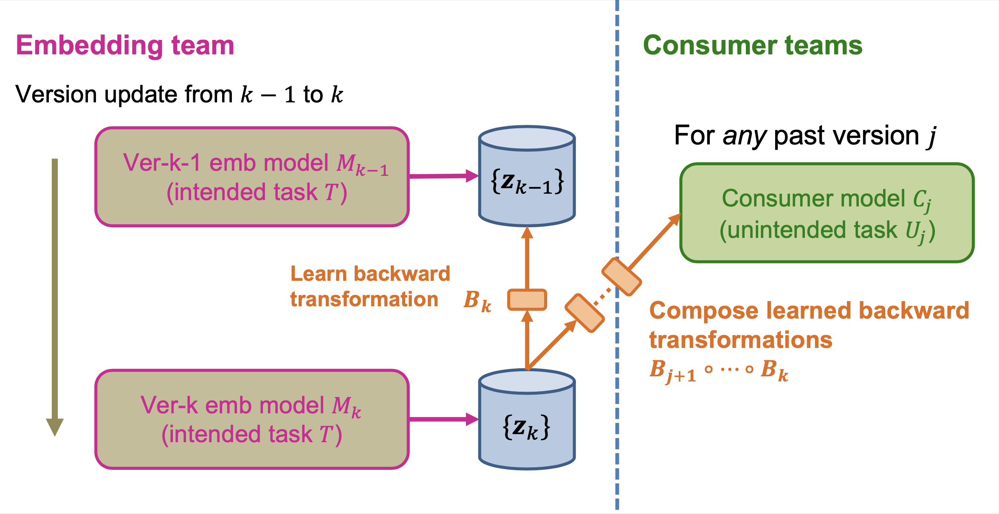

# Learning Backward Compatible Embeddings

This repo provides the source code for our KDD 2022 paper "Learning Backward Compatible Embeddings".
Weihua Hu, Rajas Bansal, Kaidi Cao, Nikhil Rao, Karthik Subbian, Jure Leskovec.

**Problem formulation.** 
The embedding team trains embedding model $M_0$ to solve their intended task $T$. The consumer teams may then utilize the produced embeddings $\{z_0\}$ to solve some unintended task $U_0$ using consumer model $C_0$. The issue arises when the embedding team releases new improved versions of the embedding model $M_1, M_2, \ldots$ over time. At version $k$, the latest-version embedding model $M_k$ produces ver-$k$ embeddings $\{z_k\}$ that are incompatible with consumer model $C_0$ that is trained on the ver-0 embeddings $\{z_0\}$. Our goal is to quickly transform the latest-version embedding $z_k$ into a backward compatible historical version of it so that existing consumer models can readily use the transformed embedding without being retrained.


<p align='center'>
  
</p>


**Overview of our framework.**
We train a new embedding model $M_k$ and a light-weight backward transformation function $B_k$ by optimizing the two training objectives simultaneously: (1) to solve the intended task $T$, and (2) to align ver-$k$ embeddings $\{z_k\}$ to ver-$k-1$ embeddings $\{z_{k-1}\}$ using $B_k$. We use the latest-version embedding model $M_k$ to produce embeddings $\{z_k\}$ and store them.
For any existing consumer model $C_j$ requesting a ver-$j$ compatible embedding, we compose the learned backward transformations on-the-fly.


<p align='center'>
  
</p>


## Installation
We used the following Python packages for core development. We tested on `Python 3.8`.
```
pytorch                   1.10.1+cu102            
torch-geometric           2.0.3
tqdm                      4.59.0
```

Then, install our `recsys` package as follows.
```bash
pip install -e .
```

## Prepare the Amazon Datasets
`cd dataset_preprocessing/amazon` and follow the instruction [here](dataset_preprocessing/amazon/). This woud download the raw data and create `files/` directory that stores all the pre-processed data.

## Training Embedding Models for the Intended Task
Generate all the scripts for the intended task by
```bash
cd embevolve/intended_task
python run_intended.py
```
Run all the scripts. This would train embedding models and save the embeddings as well as their intended task performance under `embevolve/intended_task/checkpoint/`.

## Training Consumer Models for the Unintended Task
Generate all the scripts for the unintended tasks by
```bash
cd embevolve/unintended_task
python run_unintended.py
```
Run all the scripts. This would train consumer models and save them under `embevolve/unintended_task/checkpoint/`. 
Furthermore, the saved consumer models will be used to make predictions. The results are saved under `embevolve/unintended_task/result/`.

## Generating Tables/Figures
Once everything above is run, you can generate the tables and figures in our paper using our jupyter notebook at `embevolve/analyze_all_results.ipynb`.

